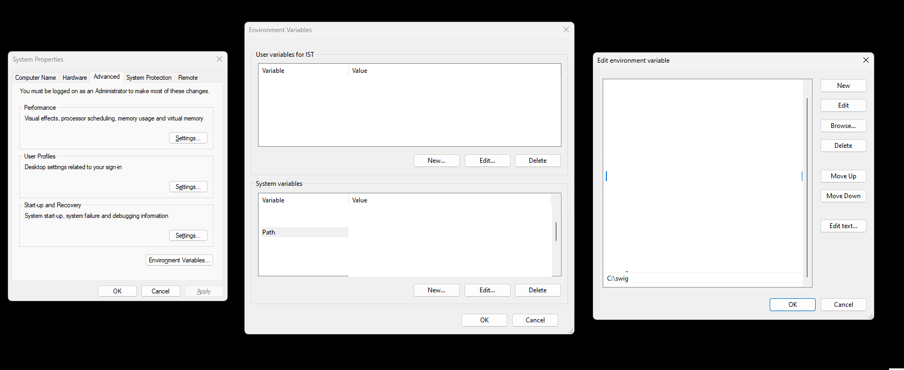

# delivery simulator


This delivery simulator is a simplified version in 2D using Pygame and Box2D-python as the physics and game engine. The objective of the simulation is to transport the object (blue square) which is placed on top of the tray (red rectangle) from the bottom-left of the screen to the bottom-right of the screen.


# Requirement
1. Python
2. Pygame ```pip install pygame```
3. Swig 
* Ubuntu: ```pip install swig```
* Windows: Download [swig](https://www.swig.org/download.html), extract, and edit windows environment variable inside Path section

4. Box2D ```pip install box2d```

# Environment Template
This template is an environment setup without any learning where user can manually control the tray (red rectangle) with these buttons:

* Left arrow: move to the left
* Right arrow: move to the right
* Down arrow: stop
* r button: reset to an initial position

During the simulation, the position and velocity of both objects will be printed out to the screen.

To customize the environment properties, you can browse to the list below:

* gravity: The simulation is normally set to 9.81

* PPM: This is a Pixel Per Meter unit where we can map the distance between the output screen (pixel unit) and the real world (meter). The example below means that it takes 200 pixel in the screen as 1 meter in the real world.

```PPM = 200```

* rect_width, rect_height: width and height of the tray in meter * PPM.

* rect_position: an initial position of the tray, normally it is set to the bottom left of the screen.

* rect_mass: Tray weight in kg unit

* rect_density: The density is calculated from mass*area (in 2D) if the rect_width, height is changed this part has to change too.

* rect_friction: change tray friction

* square_width, square_height: width and height of the square in meter * PPM.

* square_position: an initial position of the square, normally it is set on top at the middle of the tray.

* square_mass: Tray weight in kg unit

* square_density: The density is calculated from mass*area (in 2D) if the square_width, height is changed this part has to change too.

* square_friction: change object friction

* **Note that the Box2D and Pygame has different y-axis where Pygame use the y-down direction and Box2D use the y-up direct. When you implement the other object beside this, keep that in mind that you have to calibrate the Pygame drawing position to match the Box2D object position.**

# mICO template
This template includes the modified Input Correlation-Based Learning (mICO), the neural network to automatically learn and adjust the speed via the change of the object (i.e., its position).