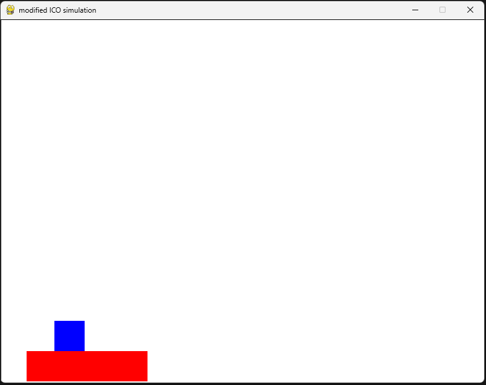

# delivery simulator



This delivery simulator is a simplified version in 2D using Pygame and Box2D-python as the physics and game engine. The objective of the simulation is to transport the object (blue square) which is placed on top of the tray (red rectangle) from the bottom-left of the screen to the bottom-right of the screen.


# Requirement
1. Python
2. Pygame ```pip install pygame```
3. Swig 
* Ubuntu: ```pip install swig```
* Windows: Download [swig](https://www.swig.org/download.html), extract, and edit windows environment variable inside Path section

4. Box2D ```pip install box2d```

# Execution
To execute the simulation just use ```python "filename".py``` where filename is the file you want to run. For mICO, the learning process is automatic and the log is saved in ```\data\"fileoutput".py``` where fileoutput is set in the code.

# Environment Template
This template is an environment setup without any learning where user can manually control the tray (red rectangle) with these buttons:

* Left arrow: move to the left
* Right arrow: move to the right
* Down arrow: stop
* r button: reset to an initial position

During the simulation, the position and velocity of both objects will be printed out to the screen.

# Customization

To customize the environment properties, you can browse to the list below:

* gravity: The simulation is normally set to 9.81

* PPM: This is a Pixel Per Meter unit where we can map the distance between the output screen (pixel unit) and the real world (meter). The example below means that it takes 200 pixel in the screen as 1 meter in the real world.

* rect_width, rect_height: width and height of the tray in meter * PPM.

* rect_position: an initial position of the tray, normally it is set to the bottom left of the screen.

* rect_mass: Tray weight in kg unit

* rect_density: The density is calculated from mass*area (in 2D) if the rect_width, height is changed this part has to change too.

* rect_friction: change tray friction

* square_width, square_height: width and height of the square in meter * PPM.

* square_position: an initial position of the square, normally it is set on top at the middle of the tray.

* square_mass: Tray weight in kg unit

* square_density: The density is calculated from mass*area (in 2D) if the square_width, height is changed this part has to change too.

* square_friction: change object friction

**Note that the Box2D and Pygame has different y-axis where Pygame use the y-down direction and Box2D use the y-up direct. When you implement the other object beside this, keep that in mind that you have to calibrate the Pygame drawing position to match the Box2D object position.**

# mICO template
This template includes the modified Input Correlation-Based Learning (mICO), the neural network to automatically learn and adjust the speed via the change of the object (In this case, we use the difference between current position of the object (square) and reference postion of the tray (rectangle)). The goal is to find the optimal speed to deliver the object while the object staying in the acceptable area. The learning is divided into parts below:

## Signal generator
The signal generator is used to transform the position of the object into signals. In this simulation, we only use deviation of position on the x-axis between object (**square_pos.x**) and the tray (**rect_pos.x**) two creates three signals based on thee threshold:

* Exemption threshold (et): this threshold allows the object to move freely within this range without triggering anything. It is used to cover the minor deviation from external disturbance in real world.

* Predictive threshold (pt): this threshold is the further area where it generates the predictive signal for the tray.

* Reflexive threshold (rt): this threshold is a last area where it generate the reflexive signal.

* SO: signal of the object detection; it is active (as constant of 1) if the object stays inside the learning area. Otherwise, 0.

* SP: predictive signal; the prior signal use to signal the tray that it should slow itself down. In this state, the learning mechanism still inactive.

* SR: reflexive signal; the later signal use to signal the tray that it must slow itself down. In this state the learning mechanism become active and adapt its speed to the possible optimal point.


As mentioned earlier, we use the difference of x_position comparing to the treshold to create the signals with a normalization between 0, 1.

However, you can modify the threshold of the signal in the code:

``` 
et = 10
pt = 30
rt = 70
```

## learning mechanism
After retrieving those three signals, it can be used in the mICO learning in two parts:

* output part: the output manipulates from the signals and the learning weight with the constant factor.
* weight update part: this is 

## Output

## Logs